# Architecture technique

## Objectif

Mettre en place une architecture multi-agents LangGraph spécialisée santé, avec un agent superviseur médical et un agent de supervision technique.

## Graphe LangGraph

```mermaid
flowchart LR
    START --> MON[initialisation_monitoring]
    MON --> MEM[memoire_conversation]
    MEM --> RAG[rag_hybride_medical]
    RAG --> SUP[superviseur_medical]
    SUP --> AG[agent_specialiste]
    AG --> SAFE[controle_securite]
    SAFE --> HITL[gate_hitl_medical]
    HITL --> TECH[agent_supervision_technique]
    TECH --> PERSIST[persistance_observabilite]
    PERSIST --> END
```

## Rôle des agents

### Superviseur médical

Classe la demande patient et choisit : GENERALISTE, CARDIOLOGUE, CANCEROLOGUE ou URGENCE.

### Agent spécialiste

Produit une réponse médicale prudente selon la décision du superviseur.

### Contrôleur sécurité

Nettoie les formulations trop certaines, ajoute la mention de non-remplacement médical et renforce l'urgence si nécessaire.

### Gate HITL

Bloque les cas MEDIUM/HIGH/EMERGENCY en mode `AUTO_LOW_RISK_ONLY` et demande validation humaine.

### Superviseur technique

Contrôle les KPI d'exécution : correlation ID, latence, coût, tokens, erreurs, risque hallucination.

## Stockage

SQLite local :

- `executions` : métriques et traces par correlation ID ;
- `messages` : historique conversationnel ;
- `feedback` : retours humains / hallucination déclarée.

## API

- `POST /api/chat` : exécute le graphe ;
- `GET /api/metrics` : alimente le dashboard ;
- `GET /api/runs/{correlation_id}` : détail d'exécution ;
- `POST /api/feedback` : feedback hallucination ;
- `GET /health` : healthcheck.
